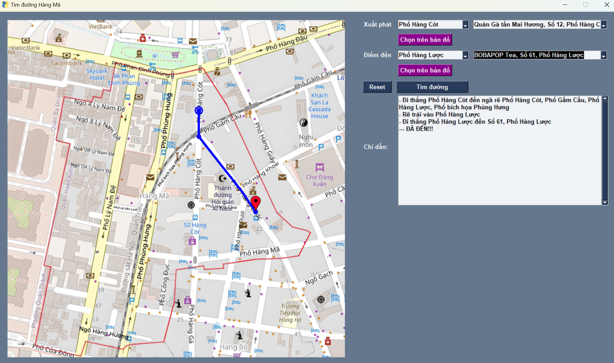
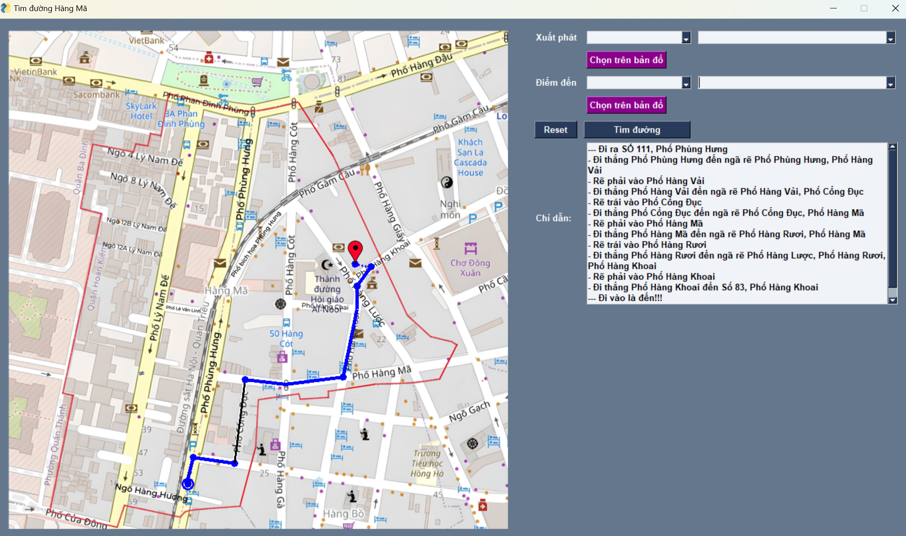

# A* Pathfinding Project

This project uses the A* algorithm to find the shortest path between two points on a map. The user interface is built using PySimpleGUI, allowing users to select start and end points from available lists or directly on the map. The resulting path is displayed on the map with the route clearly marked.

## Requirements

- Python 3.x
- PySimpleGUI
- Matplotlib (or equivalent libraries if needed)

## Installation

1. Install the required libraries:
    ```bash
    pip install PySimpleGUI matplotlib
    ```

2. Download the project source code and necessary resources (such as maps and icons) from the repository.

## Running the Project

1. Open the main file `main.py` or the primary script of the project:
    ```bash
    python main.py
    ```

2. Select the starting point and destination from the dropdown lists. You can also click directly on the map to set the start and end points.

3. Click the "Find Path" button to start the pathfinding process. The result will be displayed on the map.

4. Use the "Reset" button to clear the map and start the process over.

## Usage Instructions

- **Select Start Point:** Choose a location from the list or click directly on the map to set the start point.
- **Select End Point:** Choose a location from the list or click directly on the map to set the end point.
- **Find Path:** Click the "Find Path" button to calculate and display the shortest path from the start point to the end point.
- **Reset:** Click the "Reset" button to remove any drawn points and paths from the map.

## Result Images

### Pathfinding Result




https://github.com/user-attachments/assets/288aea25-2ddc-4a7a-8839-babbb10dbf27


## Contact

If you have any questions or encounter issues, please contact us via email: [dinhnhatky16012003@gmail.com](dinhnhatky16012003@gmail.com).

## License

This project is licensed under the MIT License.
